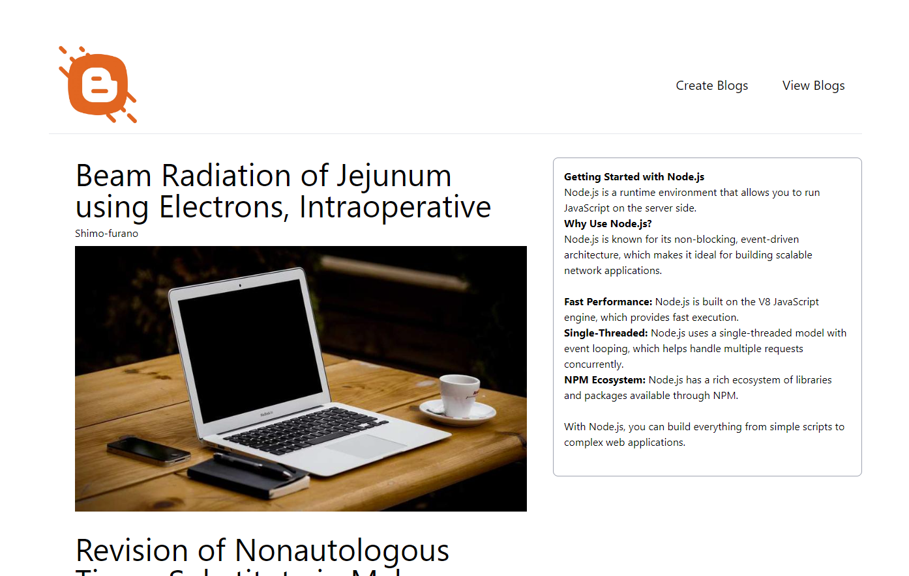

# Blog-website
A Practice Task where I get to learn about React-Quill during my Internship at TIERS

## Languages and Tools
- React
- Tailwind
- SQL
- Express
- React- Quill

## Setup
- Use this command to create express application `npm express-generator anyName`

## Points to Ponder
- In this project, I learn about node mailer, a service which allow us to recieve mails when certain a event occur
