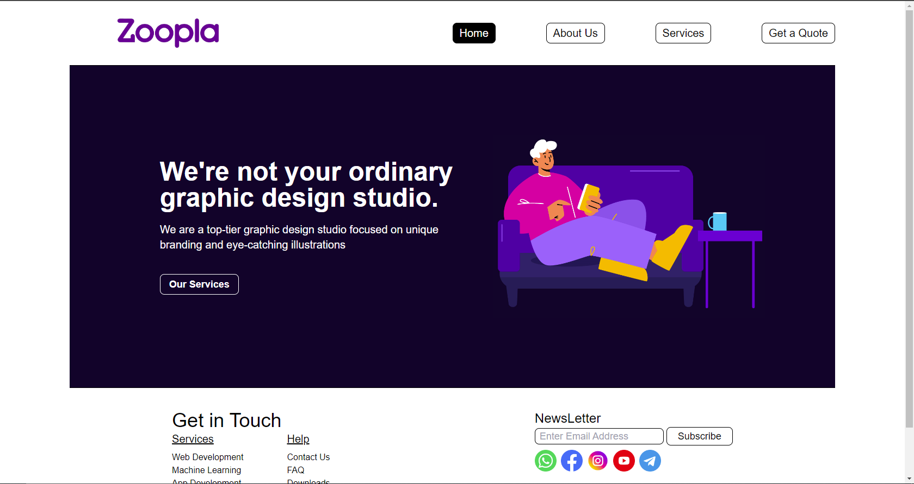

# A Software House Website 
A Final Project using HTML, CSS and Javascript during my Internship at TIERS Limited

## Languages
- HTML
- Tailwind
- Javascript

## Notes
- Make sure to run `npx tailwindcss -i ./input.css -o ./output.css --watch` for tailwind

- Nothing Much was to learn as I already knew these things